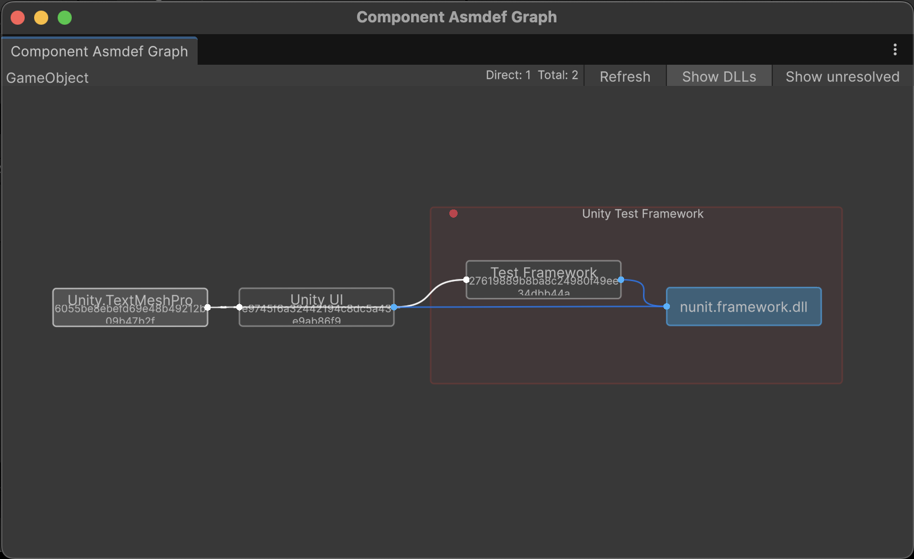

[English](README.md) | 日本語

# muAsmdefgraph

Assembly Definition の参照関係を、グラフで見られる Editor 拡張です。

どの asmdef がどれを参照しているか、ノードと線で把握できます。



Unity 2022.3 以降。MIT License。

## インストール

Unity の Package Manager から、Git URL で追加します。

```
https://github.com/uisawara/mmzkworks-unitypackages.git?path=Assets/UnityPackages/works.mmzk.muasmdefgraph
```

## 開き方

Project で `.asmdef` を選んで `Assets/Open Asmdef Graph` から開けます。

Hierarchy の GameObject からは、`GameObject/muAsmdefgraph/Open Component Asmdef Graph` で、付いているスクリプトの asmdef グラフを開けます。

[muHierarchy](../works.mmzk.muhierarchy/README.ja.md) の Asmdef View と組み合わせると、シーン上のオブジェクトと asmdef の対応も追いやすくなります。

## グラフ

ノードをドラッグして並べ替え、パンとズームで全体を見渡せます。ノードをダブルクリックすると、Project 上の asmdef を選べます。

配置やコメントは、開いているルートごとに保存されます。

## その他機能

### DLL / unresolved

ツールバーの `Show DLLs` と `Show unresolved` で、プリコンパイル参照や解決できなかった参照の表示を切り替えられます。

### コメント

グラフ上にコメント枠を置いて、関連するノードをまとめておけます。
