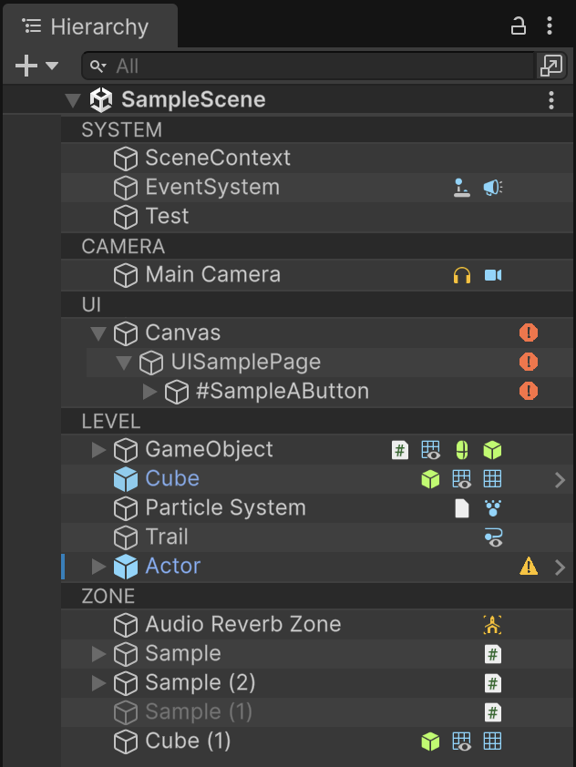
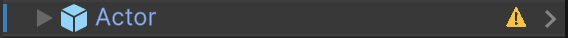
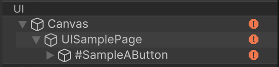
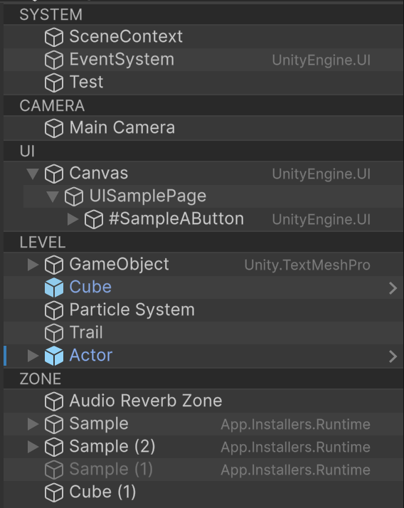
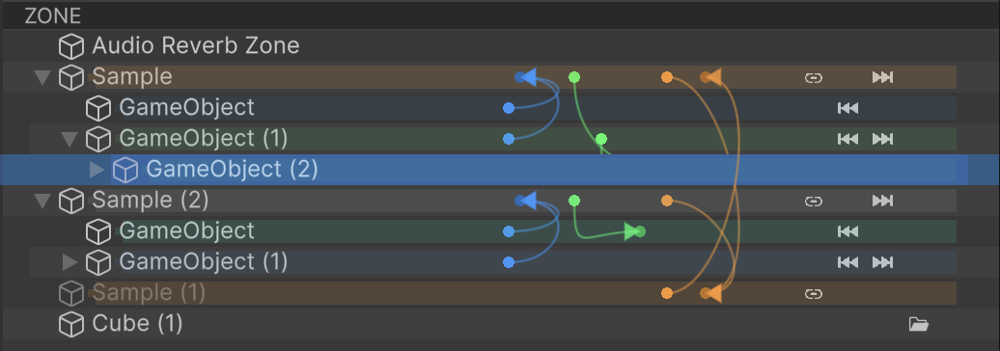

English | [日本語](README.ja.md)

# muHierarchy

An Editor extension that makes Unity's Hierarchy Window a bit easier to read.

Prefab status, Component icons, and Tag / Layer coloring appear in the Hierarchy. Switch what you see from `Tools/muHierarchy`.



Unity 2022.3 or later. MIT License.

## Installation

Add it from Unity Package Manager with a Git URL.

```
https://github.com/uisawara/mmzkworks-unitypackages.git?path=Assets/UnityPackages/works.mmzk.muhierarchy
```

## Component icons

In the default Component View, icons for each object's Components appear on the right. You can tell Cameras, Canvases, Particles, and so on without expanding the name.

## Unapplied prefab changes

When a Prefab instance has unapplied changes, a yellow warning appears. That makes it easier to notice a missed Apply.



## Missing Script

Objects with a Missing Script get a red error icon. It also propagates to parents, so you can find them even when the hierarchy is collapsed.



## Asmdef View

Switch to `Tools/muHierarchy/View Mode/Asmdef View` to see the Assembly Definition name of attached scripts. You can check which asmdef the code belongs to from the Hierarchy.

Combined with [muAsmdefgraph](../works.mmzk.muasmdefgraph/README.md), it is easier to follow references between asmdefs.



## Reference View

In `Tools/muHierarchy/View Mode/Reference View`, object references are drawn as lines. Parent/child, external references, and asset reference direction are listed at a glance.
Whether an object has references is also shown with icons.



This is a simplified view. Not every reference visible in the Inspector appears in the Hierarchy.

## Other features

### Section headers

Header rows such as `SYSTEM` / `UI` / `LEVEL` can be separated by Tag background color.

### Component Name View

Lists attached Component type names on the right.

### Prefab Path View

Shows the source asset path of Prefab instances.

### Mesh / Material / Shader View

Shows the names of the Mesh, Material, and Shader in use.

All of these can be switched from `Tools/muHierarchy`.
