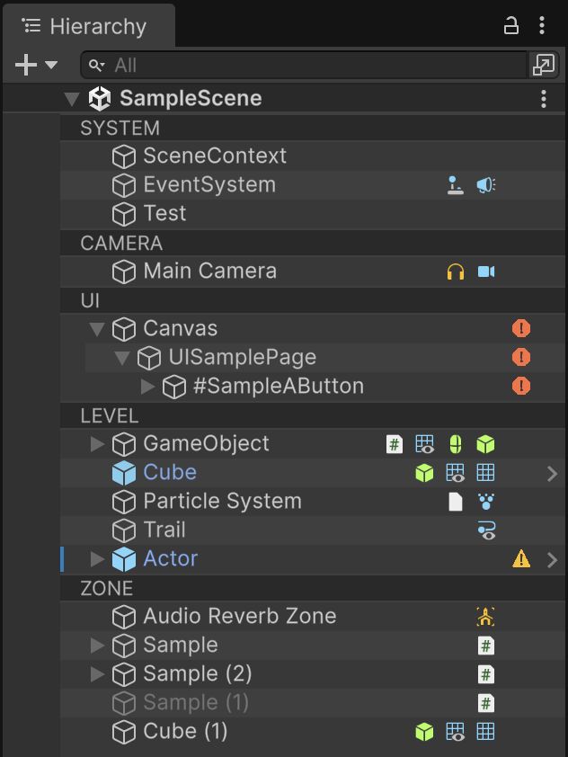
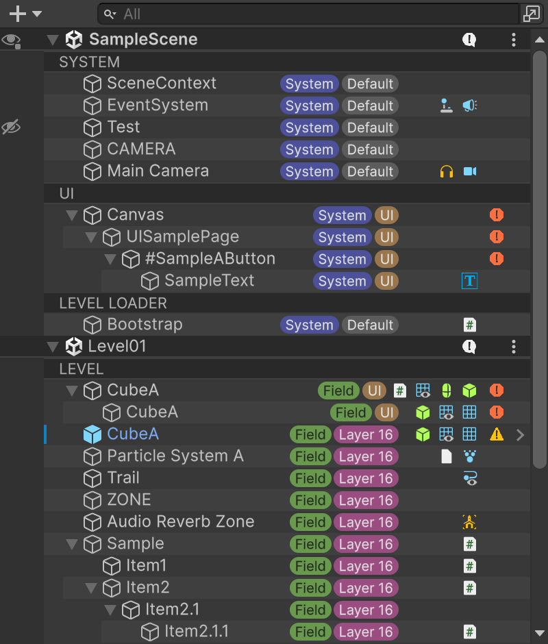
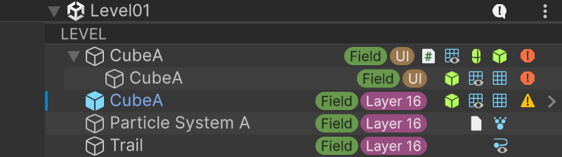
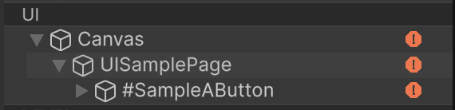
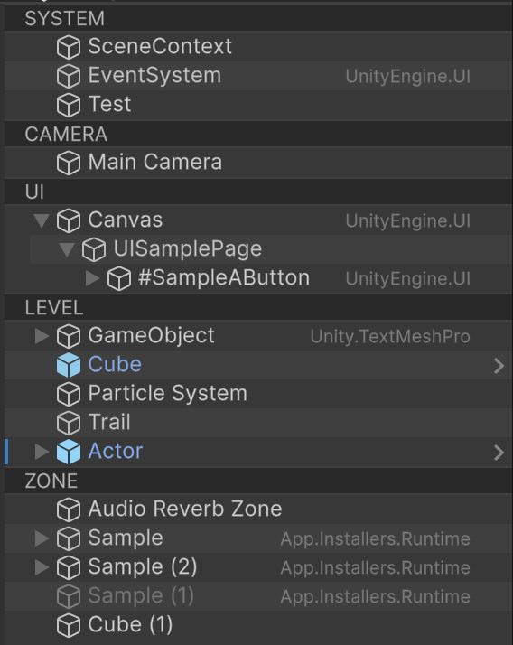
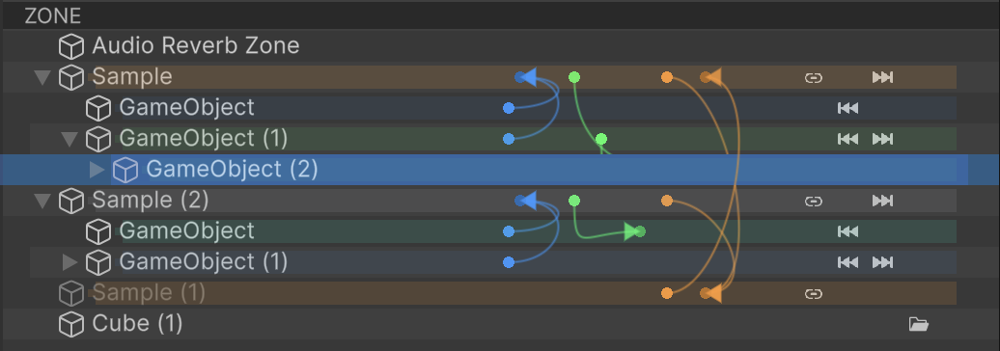

English | [日本語](README.ja.md)

# muHierarchy

An Editor extension that makes Unity's Hierarchy Window a bit easier to read.

Prefab status, Component icons, and Tag / Layer coloring appear in the Hierarchy. Switch what you see from `Tools/muHierarchy`.



Unity 2022.3 or later. MIT License.

## Installation

Add it from Unity Package Manager with a Git URL.

```
https://github.com/uisawara/mmzkworks-unitypackages.git?path=Assets/UnityPackages/works.mmzk.muhierarchy
```

## Component icons

In the default Component View, icons for each object's Components appear on the right. You can tell Cameras, Canvases, Particles, and so on without expanding the name.

## Tag / Layer

In Component View, you can tell Tags and Layers apart at a glance (`Untagged` and `Default` are gray; layers without a name in the Tag Manager show their number, e.g. `Layer 16`).



Click a band to open a menu and change the Tag / Layer in place. Clicking a selected object applies the change to all selected objects. It is undoable. When changing the Layer of an object with children, you are asked whether to change the children too, as in the Inspector.

In scenes where [muValidation](../works.mmzk.muvalidation/README.md) SceneRules apply, Tags / Layers the rules forbid are grayed out in the menu with the reason: forbidden tags and layers, and combinations outside the allowed layers per tag or per component.

Toggle the bands with `Tools/muHierarchy/Label Background/Enable`.

### Customizing colors

Run `Tools/muHierarchy/Label Background/Create Color Settings` to create and select `Assets/Settings/muhierarchy/LabelColorSettings.asset` (or select it if it exists). It is filled with the current colors; change them in the Inspector and the Hierarchy updates right away. You can also create one from `Create > muHierarchy > Label Color Settings`.

- **Auto colors**: saturation, value (brightness), and alpha of the auto colors
- **Tags / Layers**: pick a Tag / Layer from the dropdown and set its background color. Turn on `Override Text Color` to set the text color too (otherwise white or black is picked to contrast with the background)

Tags / Layers not in the lists keep their auto colors. If there are several settings assets, `Assets/Settings/muhierarchy/LabelColorSettings.asset` is used, otherwise the first by path.

## Unapplied prefab changes

When a Prefab instance has unapplied changes, a yellow warning appears. That makes it easier to notice a missed Apply.



## Missing Script

Objects with a Missing Script get a red error icon. It also propagates to parents, so you can find them even when the hierarchy is collapsed.

With [muValidation](../works.mmzk.muvalidation/README.md) installed, objects whose validation attributes report errors get the same error icon, and those with only warnings get the warning icon (in place of the Prefab icon). Hover to see the messages. Scene header rows also get an info icon on the right when muValidation SceneRules apply to the scene; click it to select the SceneRules asset (choose from a menu when several apply). Without muValidation, nothing changes.



## Asmdef View

Switch to `Tools/muHierarchy/View Mode/Asmdef View` to see the Assembly Definition name of attached scripts. You can check which asmdef the code belongs to from the Hierarchy.

Combined with [muAsmdefgraph](../works.mmzk.muasmdefgraph/README.md), it is easier to follow references between asmdefs.



## Reference View

In `Tools/muHierarchy/View Mode/Reference View`, object references are drawn as lines. Parent/child, external references, and asset reference direction are listed at a glance.
Whether an object has references is also shown with icons.



This is a simplified view. Not every reference visible in the Inspector appears in the Hierarchy.

## Other features

### Section headers

Header rows such as `SYSTEM` / `UI` / `LEVEL` can be separated by Tag background color.

### Component Name View

Lists attached Component type names on the right.

### Prefab Path View

Shows the source asset path of Prefab instances.

### Mesh / Material / Shader View

Shows the names of the Mesh, Material, and Shader in use.

All of these can be switched from `Tools/muHierarchy`.
