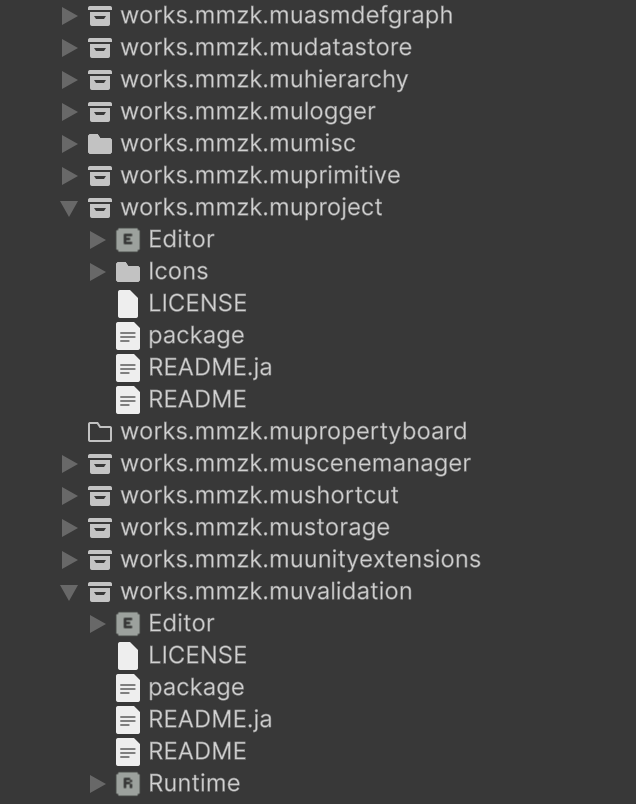

[English](README.md) | 日本語

# muProject

Unity の Project ウィンドウを、もう少し見やすくする Editor 拡張です。

フォルダの中身に応じて、フォルダアイコンが変わります。たとえば `package.json` があるフォルダ(UPM パッケージ)は、パッケージのアイコンになります。



Unity 2022.3 以降。MIT License。

## インストール

Unity の Package Manager から、Git URL で追加します。

```
https://github.com/uisawara/mmzkworks-unitypackages.git?path=Assets/UnityPackages/works.mmzk.muproject
```

## フォルダアイコン

| フォルダ | アイコン |
| --- | --- |
| `FolderSettings` アセットのパスパターンに一致する | そのパターンに設定したアイコン |
| `package.json` がある(UPM パッケージのルート) | パッケージのアイコン |

`Tools > muProject > Custom Folder Icons` でオン・オフを切り替えられます。

アイコンは他の Project ウィンドウ拡張より先に描きます。muValidation の ✗ マークなどは、アイコンの上に表示されます。

### パスでアイコンを指定する(FolderSettings)

対象にしたいフォルダで `Create > muProject > Folder Settings` を選んで `FolderSettings` アセットを作り、`Folder Icons` にルールを追加します。

| 項目 | 説明 |
| --- | --- |
| Path Pattern | フォルダのプロジェクトパス(`Assets/Scenes`、`Packages/com.example.foo` など)に対する正規表現 |
| Icon | 一致したフォルダに表示するテクスチャ |

例:

| Path Pattern | 一致するフォルダ |
| --- | --- |
| `^Assets/Scenes$` | `Assets/Scenes` だけ |
| `/Editor$` | `Editor` という名前のフォルダすべて |
| `^Assets/Art(/.*)?$` | `Assets/Art` とその下のフォルダすべて |

- ルールは上から順に調べ、最初に一致したものを使います。
- `FolderSettings` アセットは、置いたフォルダとその配下のフォルダだけに効きます。パターンはプロジェクトのフルパスに対して調べます。
- `FolderSettings` アセットは複数置けます。複数が効くときは、より深いフォルダに置いたものを先に使います。
- パスのルールは、パッケージのアイコンより優先します。
- 正しくないパターンは、Console に警告を出して無視します。

### アイコンを追加する

Editor アセンブリで `IFolderIconProvider` を実装します。自動で見つけて使います。

```csharp
using System.IO;
using Mmzkworks.muProject.Editor;
using UnityEditor;
using UnityEngine;

public class SceneFolderIconProvider : IFolderIconProvider
{
    public int Order => 100;

    public Texture GetIcon(string folderPath)
    {
        return Directory.GetFiles(folderPath, "*.unity").Length > 0
            ? EditorGUIUtility.IconContent("SceneAsset Icon").image
            : null;
    }
}
```

- `Order` の小さい順に呼び、最初に null 以外を返したアイコンを使います。組み込みのパッケージアイコンは `Order` 0、`FolderSettings` のルールは `Order` -100 です。
- null を返すと、元のフォルダアイコンのままです。
- 結果はキャッシュし、アセットが変わるたびに消します。`GetIcon` の中でファイルを読んでも大丈夫です。
