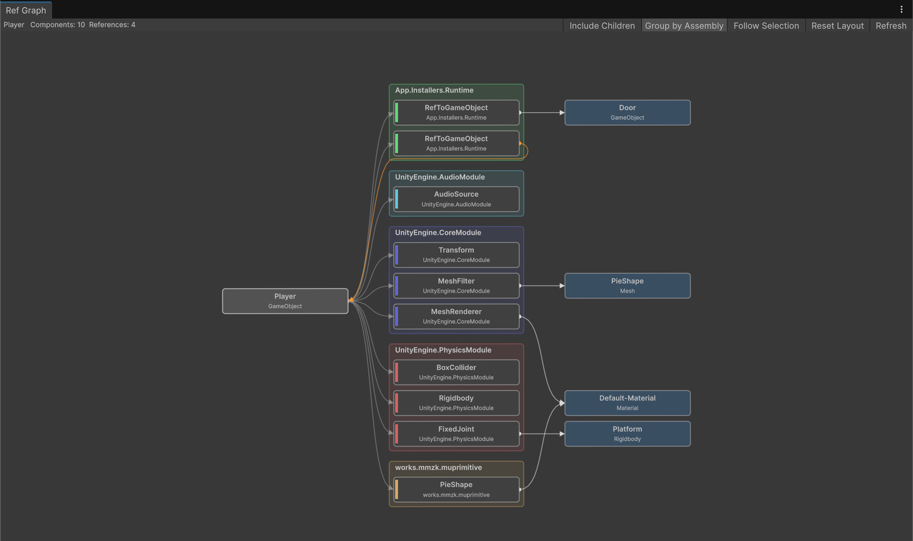
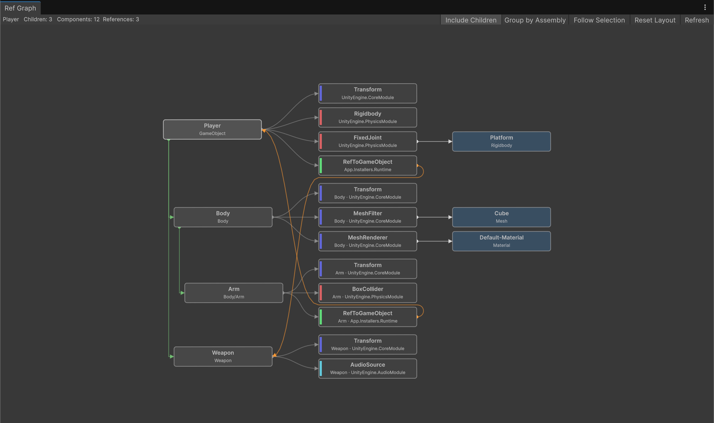

[English](README.md) | 日本語

# muRefgraph

GameObject や Prefab が持つ Component と、各 Component のフィールドが参照しているオブジェクトを、グラフで見られる Editor 拡張です。

Component を所属アセンブリ（asmdef）ごとにまとめて並べ替えることもできます。



Unity 2022.3 以降。MIT License。

## インストール

Unity の Package Manager から、Git URL で追加します。

```
https://github.com/uisawara/mmzkworks-unitypackages.git?path=Assets/UnityPackages/works.mmzk.murefgraph
```

## 開き方

Hierarchy の GameObject からは、`GameObject/muRefgraph/Open Ref Graph` で開けます。

Project で Prefab を選んで `Assets/Open Ref Graph` から開けます。

`Window/muRefgraph/Ref Graph` からも開けます（選択中の GameObject が対象になります）。

## グラフ

左から、対象の GameObject、Component、フィールドが参照しているオブジェクトの順に並びます。

- 標準では対象自身の Component だけを表示します。子の GameObject も含めるには、後述の `Include Children` を有効にします。
- 参照は 1 段だけ辿ります。同じオブジェクトを複数のフィールドで参照している場合は 1 本の線にまとめます。
- 同じ GameObject 自身や、その別の Component を参照しているときは、オレンジの線でつなぎます。参照の線は常に Component の右側から出て、左へ戻る線はノードの隙間を回り込みます。
- ノードにカーソルを合わせると、つながっている線とフィールド名が表示されます。

ノードをドラッグして並べ替え、パンとズームで全体を見渡せます。ノードをダブルクリックすると、そのオブジェクトを選択します。`Home` キーで全体を中央に戻せます。

| 操作 | 内容 |
| --- | --- |
| 左ドラッグ（ノード） | ノードの移動 |
| 左ドラッグ（背景） | 矩形選択 |
| Ctrl / Cmd + クリック | 選択の追加・解除 |
| 中ボタン / Alt + 左ドラッグ | パン |
| ホイール | ズーム |
| ダブルクリック | オブジェクトを選択して Ping |

## Include Children

ツールバーの `Include Children` を有効にすると、子孫の GameObject とその Component もグラフに含めます。



- 子の GameObject は左の列に Hierarchy の順で、深さに応じて字下げして並びます。親子は Hierarchy ウィンドウのようなツリー型の緑の線でつながります。
- 子の Component の下段には、持ち主の GameObject 名が付きます。
- 子や子の Component への参照は、参照先ノードではなく、その子のノードへの線になります。

## Group by Assembly

ツールバーの `Group by Assembly` を有効にすると、Component を型の所属アセンブリごとに枠でまとめて並べ替えます。Component の左端の色帯は、所属アセンブリごとの色です。

並べ替えた配置は、`Group by Assembly` の有効・無効それぞれで別々に保持されます。`Reset Layout` で元の配置に戻せます。

## その他機能

### Follow Selection

ツールバーの `Follow Selection` を有効にすると、Hierarchy や Project で選んだ GameObject に追従して表示を切り替えます。
