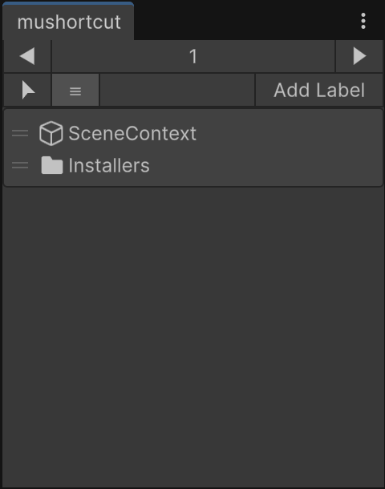

English | [日本語](README.ja.md)

# muShortcut

An Editor extension that keeps frequently used Hierarchy and Project objects at hand.

Pick them with one click instead of searching scenes or folders. Open the window from `Tools/muShortcut/Shortcuts`.



Unity 2022.3 or later. MIT License.

## Installation

Add it from Unity Package Manager with a Git URL.

```
https://github.com/uisawara/mmzkworks-unitypackages.git?path=Assets/UnityPackages/works.mmzk.mushortcut
```

## Shortcuts

Drag and drop Hierarchy or Project objects onto the window to add them.

Click to select. Project assets are pinged, and folders can be opened.

## Pages

Switch pages with ◀ ▶. Right-click a page number to add or remove pages. Split them by purpose.

## Other features

### View modes

Switch between icon view and list view. Icon size can be changed in icon view.

### Labels

Use `Add Label` to place a heading. Use it as a colored divider.
