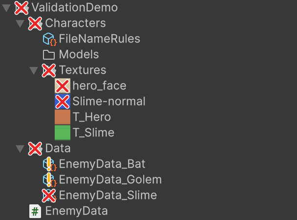
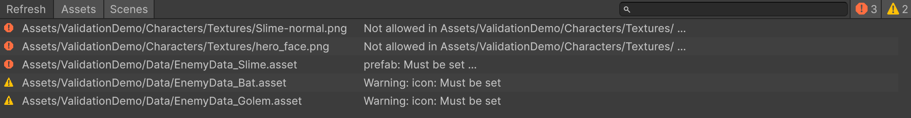

[English](README.md) | 日本語

# muValidation

問題のあるアセットやオブジェクトを見つけ、Project ウィンドウで印を付ける Editor 拡張です。

- **ファイル名**: 許容するファイルパスのパターンを書いた `FileNameRules` アセットを置きます。ルールに合わないファイルは、アイコンに ✗ マークが付きます。
- **シーン**: `SceneRules` アセットをシーンのフォルダに割り当てると、シーン上のオブジェクトのデフォルト名(`Cube`、`GameObject` など)、禁止した Tag・レイヤー、Tag・Component ごとに使えるレイヤー、Prefab インスタンスでないオブジェクトをチェックします。
- **オブジェクトの内容**: ScriptableObject / Component のクラスやフィールドに Validation 属性を付けます。エラーのあるアセットや prefab には赤い ✗ マーク、警告だけなら黄色い ! マークが付きます。
- **フォルダ**: エラーのあるアセットを(階層の深さに関係なく)含むフォルダにも ✗ マークが付きます。警告だけなら ! マークです。`Tools > muValidation > Show Errors On Folders` でオフにできます。

アイコンにマウスを乗せると理由が出ます。`Tools > muValidation > Validation` ですべての問題を一覧できます。



Unity 2022.3 以降。MIT License。

## インストール

Unity の Package Manager から、Git URL で追加します。

```
https://github.com/uisawara/mmzkworks-unitypackages.git?path=Assets/UnityPackages/works.mmzk.muvalidation
```

## 使い方

1. Project ウィンドウで対象フォルダを右クリックし、`Create > muValidation > File Name Rules` を選びます。
2. Inspector でルールを追加します。
3. ルールに合わないファイルのアイコンに ✗ マークが付きます。

`FileNameRules` の Inspector には、ルールに合わないファイルの一覧も出ます。クリックするとそのファイルを Ping します。

## ルールの設定

| 項目 | 説明 |
| --- | --- |
| Rules | ルールの一覧。それぞれに `Path` と `Patterns` を指定します |
| Rules > Path | `FileNameRules` アセットから見た相対パスのフォルダ。例: `Textures`、`../Shared`。空ならアセットと同じフォルダ |
| Rules > Patterns | 許容するファイルの正規表現。`Path` からの相対パスに対して判定します。例: `T_Hero.png`、`Sub/T_Hero.png`。完全一致は `^...$`。空ならすべて許容 |
| Allow Other Files | アセットのフォルダ以下で、どのルールにも該当しないファイルを許容する |
| Validate Folders | ファイルだけでなくフォルダもチェックする |

例: `Assets/Characters` に置く場合。

| Path | Patterns |
| --- | --- |
| `Textures` | `^T_[A-Za-z0-9]+\.png$` |
| `Models` | `^SM_[A-Za-z0-9]+\.fbx$`、`^SM_[A-Za-z0-9]+\.prefab$` |

`Allow Other Files` をオフにすると、`Textures` と `Models` 以外にあるファイルもエラーになります。

## 適用範囲

- ルールは、そのフォルダとすべてのサブフォルダに適用されます。パターンはサブフォルダ部分も含めて判定するので、`^T_.*` は `Sub/T_Hero.png` を許容しません。`^([^/]+/)*T_.*` と書くか、`Textures/Sub` 用のルールを追加します。
- 複数のフォルダのルールがファイルに該当するときは、一番深いフォルダのルールで判定します。
- 同じフォルダのルールはまとめて判定し、どれかに一致すれば許容します。複数の `FileNameRules` アセットにまたがっていても同じです。
- 同じフォルダに `FileNameRules` アセットを複数置けます。
- どのルールにも該当しないファイルは、一番近い親フォルダにある `FileNameRules` アセットで判定します。そのどれかで `Allow Other Files` がオフなら、エラーになります。
- `FileNameRules` アセット自体はチェックしません。

## シーンルール

シーン上の GameObject を、デフォルト名・Tag・レイヤー・Prefab インスタンスのルールでチェックします。ルールの中身と、それを適用するシーンを別々のアセットで設定するので、フォルダごとに違うルールを適用できます。

1. `Create > muValidation > Scene Rules` で `SceneRules` アセットを作り、ルールを設定します。
2. `Create > muValidation > Scene Rules Assignments` で `SceneRulesAssignments` アセットを作り、フォルダに `SceneRules` を割り当てます。

どちらも推奨の置き場所は `Assets/Settings/` です。どこからも割り当てられていない `SceneRules` は適用されません。

### SceneRules

| 項目 | 説明 |
| --- | --- |
| Severity | 問題をエラーとして報告するか、警告として報告するか |
| Default Names | Unity が新しいオブジェクトに付ける名前(`GameObject`、`Cube`、`Main Camera` など)と、その名前のままでよいか。アセット作成時に Unity の名前が入ります。Inspector の `Reset Default Names` で入れ直せます。`Cube (1)` のような複製の名前も同じ名前として扱います |
| Forbidden Tags | GameObject に使ってはいけない Tag |
| Forbidden Layers | GameObject に使ってはいけないレイヤー |
| Tag Layers | Tag ごとに、その Tag の GameObject が使えるレイヤー |
| Component Layers | Component の型(フルネーム。例: `UnityEngine.Camera`。`Select` で選べます)ごとに、その Component を持つ GameObject が使えるレイヤー。`Include Subclasses` をオンにすると派生型にも適用します |
| Require Prefab Instance | GameObject が Prefab インスタンスの一部であること。Prefab インスタンスに後から追加したオブジェクト(Added GameObject)も違反です。`EditorOnly` タグのオブジェクトとその子は対象外。Prefab Mode では中身がすべて Prefab の一部なのでチェックしません |

Inspector には、割り当て先のパスと、開いているシーンでルールに合わないオブジェクトの一覧が出ます。クリックするとそのオブジェクトを Ping します。

### SceneRulesAssignments

| 項目 | 説明 |
| --- | --- |
| Assignments > Path | プロジェクトルートからのフォルダパス。例: `Assets/Scenes/Stages`。シーンのパスも指定できます。`Assets`(または空)ならすべてのシーン |
| Assignments > Rules | そのパス以下のシーンに適用する `SceneRules` |

例:

| Path | Rules |
| --- | --- |
| `Assets` | `CommonSceneRules` |
| `Assets/Scenes/UI` | `UISceneRules` |

`Assets/Scenes/UI` 以下のシーンには `CommonSceneRules` と `UISceneRules` の両方、それ以外のシーンには `CommonSceneRules` だけを適用します。

- 複数の割り当てがシーンに該当するときは、すべてのルールを適用します。同じ `SceneRules` が重複して割り当てられていても 1 回だけ適用します。`SceneRulesAssignments` アセットが複数あるときは、まとめて扱います。
- Prefab Mode では prefab のパスで判定します。例: `Assets/Prefabs/UI/Menu.prefab` は `Assets/Prefabs/UI` の割り当てに該当します。未保存のシーンは `Assets` の割り当てだけに該当します。
- Inspector には、パスごとに該当するシーンの数が出ます。存在しないパスには警告が出ます。
- [muHierarchy](../works.mmzk.muhierarchy/README.ja.md) も入れると、ルールが適用されるシーンの Hierarchy ヘッダー行に情報アイコンが付きます。クリックすると、適用中の `SceneRules` アセットを選択します(複数あるときはメニューから選びます)。

### 適用範囲

- 開いているシーン、Build Settings で有効なシーン(Validation ウィンドウとビルド前チェック)、Prefab Mode の GameObject をチェックします。Prefab アセットはチェックしません。
- 適用される `SceneRules` がそれぞれ問題を報告します。名前は、どれかで禁止されていればエラーです。
- ルールを持つ `SceneRules` が割り当てられていると、検証対象の Component を持つ GameObject だけでなく、すべての GameObject を検証します。

## Validation 属性

Component / ScriptableObject のクラス、またはそのフィールドに Validation 属性を付けます。同じ対象に複数付けられます。

```csharp
using System.Collections.Generic;
using Mmzkworks.muValidation;
using UnityEngine;

[GameObjectName("^UI_[A-Za-z0-9]+$")]
[NotSceneRoot(Severity = ValidationSeverity.Warning)]
[RequireSceneObject("Systems/EventSystem", typeof(UnityEngine.EventSystems.EventSystem))]
public class MenuPanel : MonoBehaviour
{
    [SerializeField, RequireReference, ReferenceInChildren] private Transform content;
    [SerializeField, ReferenceInChildren] private List<GameObject> pages;
}
```

### 標準の属性

| 属性 | 対象 | チェック内容 |
| --- | --- | --- |
| `[GameObjectName("正規表現")]` | クラス | GameObject 名が正規表現に一致する。完全一致は `^...$` |
| `[SceneRootOnly]` | クラス | GameObject がシーンのルートにある(シーンのみ) |
| `[NotSceneRoot]` | クラス | GameObject がシーンのルートにない(シーンのみ) |
| `[RequireSceneObject("A/B", typeof(T))]` | クラス | シーンにパス `A/B`(ルートオブジェクトから)の GameObject がある。型を指定すると、そのコンポーネントも必要(シーンのみ) |
| `[RequireReference]` | フィールド | null や Missing でない。配列・リストは要素ごと |
| `[ReferenceInChildren]` | フィールド | 参照先が自分自身かその子孫。null は許容。階層外やアセットへの参照はエラー。配列・リストは要素ごと |
| `[NotEmpty]` | フィールド | 文字列が null・空・空白だけでない。配列・リストは要素ごと |
| `[RequireComponentInParent(typeof(T))]` | クラス | GameObject かその親に `T` コンポーネントがある |
| `[SingleInScene]` | クラス | この型のコンポーネントがシーンに 1 つだけ(非アクティブなものも数える。シーンのみ) |

- どの属性も `Severity = ValidationSeverity.Warning` を付けると、エラーではなく警告になります。
- 「シーンのみ」のチェックは、prefab アセットと Prefab Mode では行いません。
- フィールド属性は、ネストした `[Serializable]` のクラス・構造体(とその配列・リスト)のフィールドでも使えます。

### 属性を組み合わせる

`CompositeValidationAttribute` を継承し、組み合わせる Validation を返します。普通の属性と同じように使えます。

```csharp
public class UIRootAttribute : CompositeValidationAttribute
{
    protected override IEnumerable<ValidationAttribute> CreateValidations()
    {
        yield return new GameObjectNameAttribute("^UI_");
        yield return new SceneRootOnlyAttribute();
    }
}

[UIRoot]
public class HudRoot : MonoBehaviour { }

// どちらかの名前パターンに一致すれば OK
public class PlayerOrEnemyNameAttribute : CompositeValidationAttribute
{
    public PlayerOrEnemyNameAttribute() { Mode = CompositeMode.Any; }

    protected override IEnumerable<ValidationAttribute> CreateValidations()
    {
        yield return new GameObjectNameAttribute("^Player");
        yield return new GameObjectNameAttribute("^Enemy");
    }
}
```

- `CompositeMode.All`(既定): すべて満たす必要があります。各問題はそれぞれの重要度で報告し、複合属性の `Severity` を上限にします。
- `CompositeMode.Any`: どれか 1 つ満たせば OK です。満たさないときは、全部の失敗をまとめた 1 件を複合属性の `Severity` で報告します。

### 属性を追加する

`ValidationAttribute` を継承し、`context.Report` で問題を報告します。

```csharp
[AttributeUsage(AttributeTargets.Field, AllowMultiple = true)]
public class PositiveAttribute : ValidationAttribute
{
    public override void Validate(ValidationContext context)
    {
        if (context.Value is int i && i <= 0) context.Report("Must be positive");
    }
}
```

`ValidationContext` で使えるもの:

| メンバー | 説明 |
| --- | --- |
| `Target` / `GameObject` | 対象の Component / ScriptableObject と、その GameObject(ScriptableObject なら null) |
| `Location` | `Asset`(ScriptableObject)、`Prefab`(prefab アセットか Prefab Mode)、`Scene` |
| `Field` / `Value` | フィールド属性のとき、そのフィールドと値。クラス属性では null |
| `Elements()` | 配列・リストなら要素をラベル(`[0]`、`[1]`…)付きで、それ以外は値そのものを返す |
| `Report(message)` | 属性の `Severity` で問題を報告する |

結果が他のオブジェクト(名前や有無など)に左右される場合は、`RequireSceneObject` と同じく `DependsOnOtherObjects` を `true` にしてください。そうした Validation はシーン内のどの変更でも再実行し、それ以外は自分のオブジェクトが変わったときだけ再実行します。

### 結果の表示

- エラーは赤い ✗ マーク、警告は黄色い ! マークを、アセットのアイコンに重ねて表示します。ツールチップでは、警告の行の先頭に `Warning:` が付きます。
- ScriptableObject: そのアセットにマークが付きます。Validation 属性を持つサブアセットもチェックします。
- Component: prefab 内のどれかのコンポーネントが問題を報告すると、その prefab にマークが付きます。非アクティブな子やネストした prefab も対象です。メッセージには GameObject のパス、コンポーネントの型、フィールドが出ます。
- `Validate` は Editor 上でのみ呼ばれます。副作用のない処理にしてください。例外はログに出し、エラーとして表示します。
- 結果はキャッシュします。インポート・保存時は、変わったアセット(とそれをネストしている prefab)だけを再チェックし、変わっていないアセットの結果はそのまま使います。ScriptableObject を Inspector で編集するとすぐ更新されます。prefab の変更は保存後に反映されます。アセットの削除・移動時はすべて再チェックします。
- アセットの結果は `Library/muValidation/` にも保存し、スクリプトの再コンパイル、Play Mode への切り替え、Editor の再起動をまたいで使います。保存した結果は変わっていないアセットにだけ使い、Validation のコードが変わったときは破棄します。`Tools > muValidation > Clear Validation Cache` で消せます。
- フォルダのマークは `Assets` 全体をスキャンして求めます。スキャンは数フレームに分けて行うため、インポート直後は反映が少し遅れることがあります。

## Validation ウィンドウ

`Tools > muValidation > Validation` で、すべての問題を一覧できます。



- アセット(FileNameRules と Validation 属性)と、開いているシーン・Prefab Mode の GameObject(Validation 属性と SceneRules)が対象です。`Assets` / `Scenes` ボタンでそれぞれ切り替えられます。
- エラー・警告での絞り込みと、パスやメッセージでの検索ができます。
- 行をクリックするとそのオブジェクトを Ping します。ダブルクリックで選択します(アセットは開きます)。下部に全文が出ます。
- ウィンドウを開いたときと `Refresh` を押したときに集計します。

## ビルド前の Validation

Player のビルド前に Validation を実行します。既定ではエラーがあるとビルドを止めます。

- すべてのアセットと、Build Settings で有効なシーンをチェックします。開いていないシーンは裏で開き、チェック後に閉じます。
- 問題は Console に出ます(クリックで Ping)。batch mode 以外では、結果を表示した Validation ウィンドウが開きます。
- batch mode(CI)では、`BuildFailedException` でビルドが失敗します。
- `Tools > muValidation > Run Build Check` で、ビルドせずに同じチェックを実行できます。

設定は `Project Settings > muValidation` で変えられます。`ProjectSettings/muValidationSettings.asset` に保存されるので、コミットすればチームで共有できます。

| 設定 | 既定 | 説明 |
| --- | --- | --- |
| Validate Before Build | オン | ビルド前にチェックする |
| Include Assets | オン | `Assets` 以下のすべてのアセットをチェックする |
| Include Build Scenes | オン | Build Settings で有効なシーンをチェックする |
| Fail On Errors | オン | エラーがあればビルドを止める |
| Fail On Warnings | オフ | 警告があればビルドを止める |

## muHierarchy と一緒に使う

[muHierarchy](../works.mmzk.muhierarchy/README.ja.md) も入れると、Validation 属性や SceneRules がエラーを報告したシーン上のオブジェクトには赤いエラーアイコン、警告だけなら黄色い警告アイコンが、Hierarchy ウィンドウで付きます(ComponentView で Prefab アイコンを表示しているとき)。Missing Script と同じく、親にも付きます。マウスを乗せるとメッセージが出ます。

muHierarchy の Tag / Layer ラベルをクリックして変更するときは、SceneRules で禁止されている Tag / Layer がグレーアウトされ、選べません。

結果はキャッシュします。オブジェクトを編集したときはそのオブジェクトだけを再検証し、追加・削除・移動したときは、検証対象のコンポーネントを持つオブジェクトだけを集計し直します(SceneRules があるときはすべてのオブジェクト)。

Play Mode 中は既定でシーンを検証しません。`Tools > muValidation > Validate In Play Mode` でオンにすると、最短 0.5 秒ごとに更新します。
