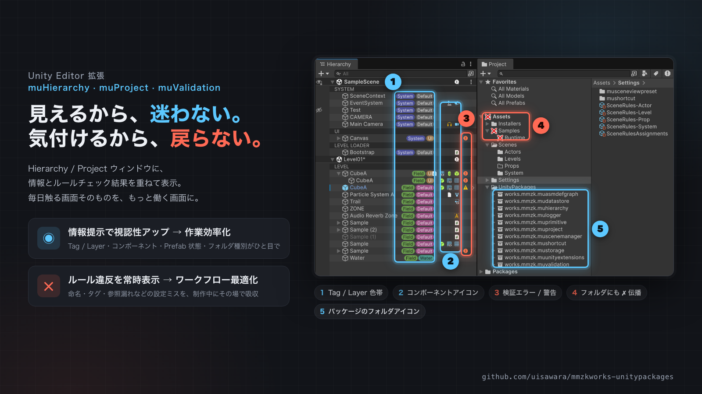
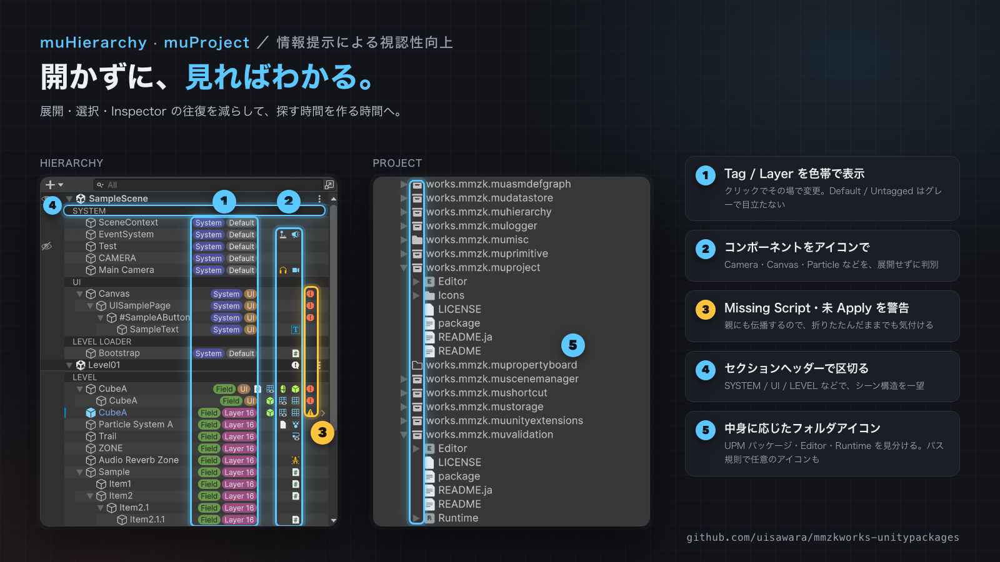
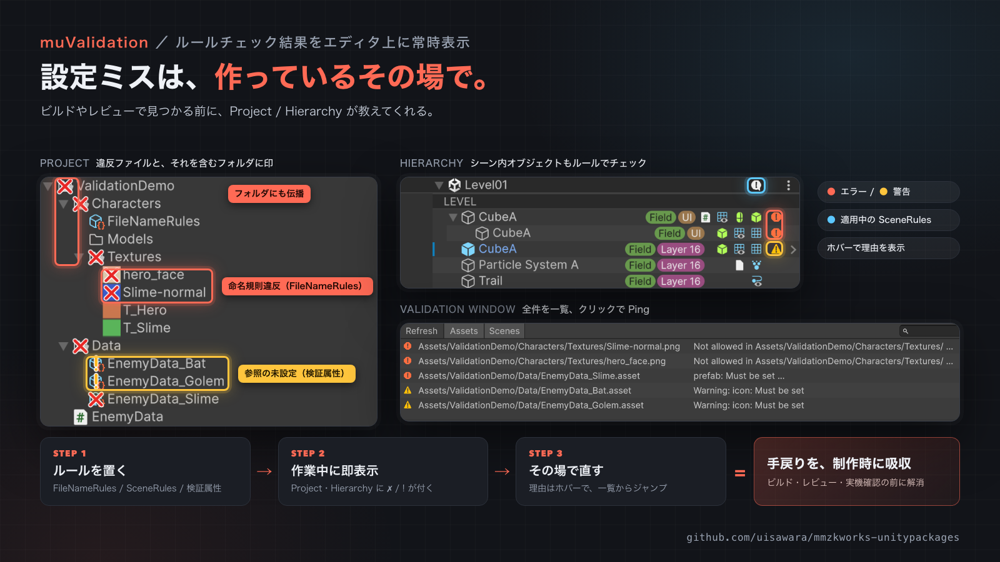
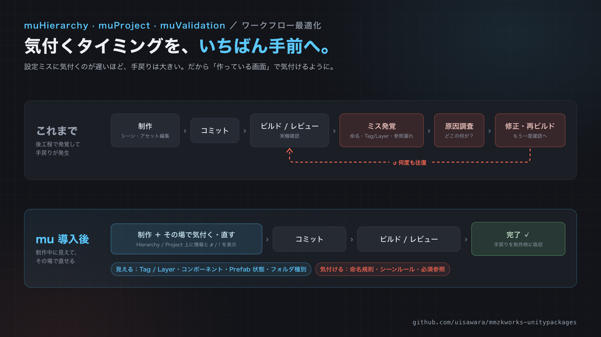
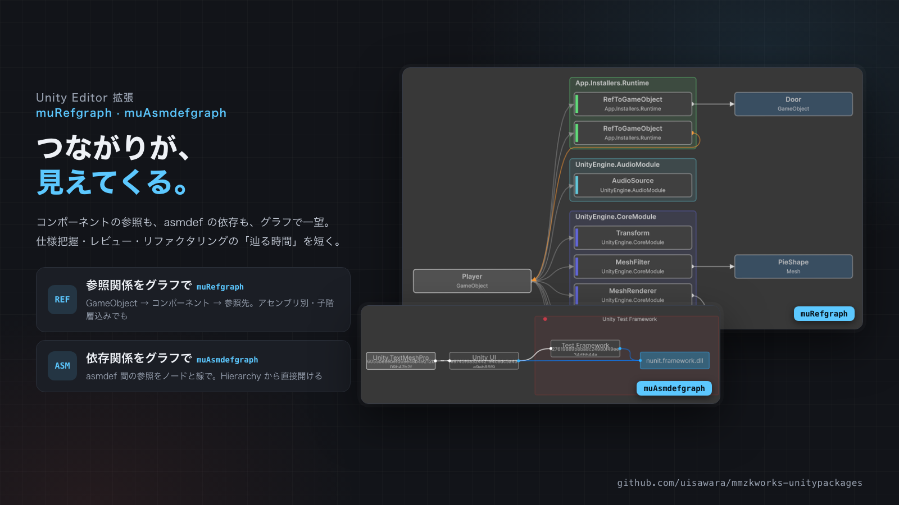
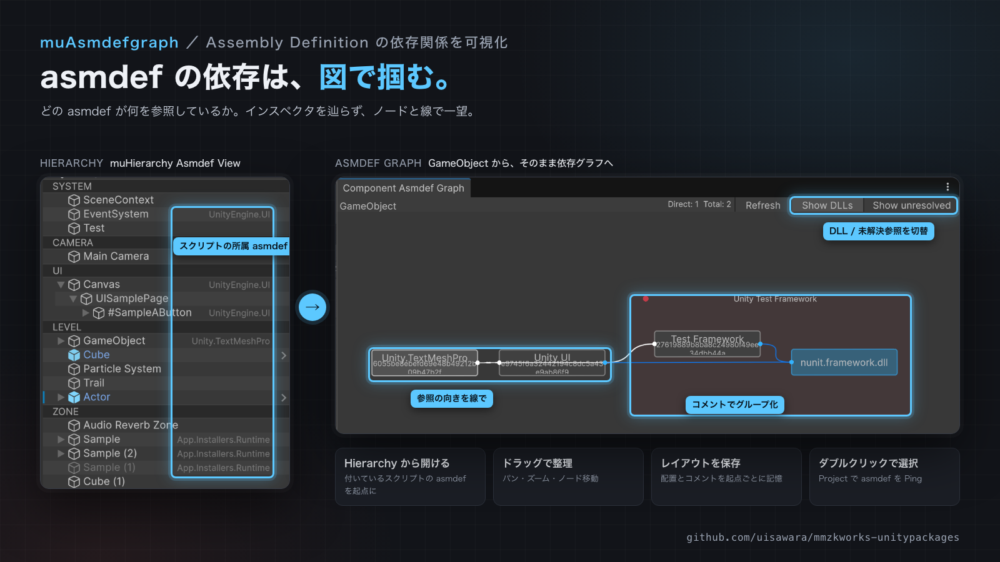
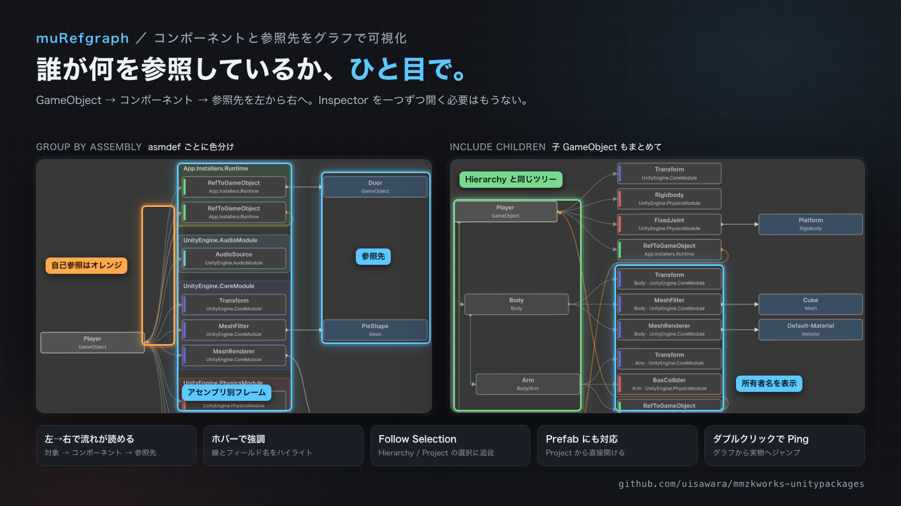
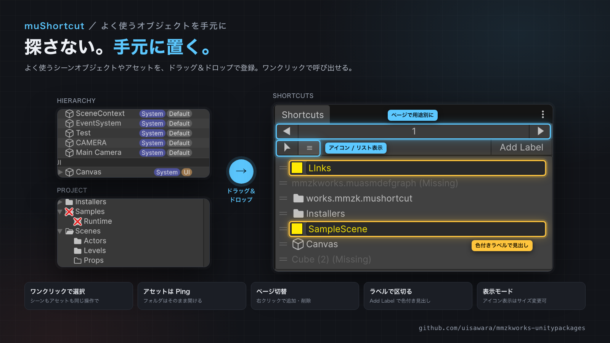

[English](README.md) | 日本語

> **NOTICE:**
> 以前から書き溜めてきたコード群を、昨今のAIが極短時間で実装できるようになってきた時流を思い、オープンにしたものです。AIを積極的に活用する方向へ舵を切っているため、生成コード比重が高くなっていく予定です。

## UPM Packages

### エディタ拡張

- [muHierarchy](Assets/UnityPackages/works.mmzk.muhierarchy/README.ja.md) — Prefab/コンポーネントのアイコン表示、Tag/Layer の色帯表示とその場での変更など、Hierarchy ウィンドウを拡張します。
- [muProject](Assets/UnityPackages/works.mmzk.muproject/README.ja.md) — フォルダの中身やパスのパターンに応じて、Project ウィンドウのフォルダアイコンを表示します。
- [muAsmdefgraph](Assets/UnityPackages/works.mmzk.muasmdefgraph/README.ja.md) — Assembly Definition の依存関係をグラフで可視化します。
- [muRefgraph](Assets/UnityPackages/works.mmzk.murefgraph/README.ja.md) — GameObject / Prefab の Component と、フィールドが参照しているオブジェクトをグラフで表示します。アセンブリ別の並べ替えもできます。
- [muShortcut](Assets/UnityPackages/works.mmzk.mushortcut/README.ja.md) — Hierarchy や Project ウィンドウのオブジェクトをショートカットで素早く選択できます。
- [muValidation](Assets/UnityPackages/works.mmzk.muvalidation/README.ja.md) — パスのルール・検証属性・シーンルールに基づいて、不正なアセットを Project ウィンドウ上でマークします。

#### 紹介画像

### シーン管理

- [muSceneManager](Assets/UnityPackages/works.mmzk.muscenemanager/README.ja.md) — UniTask を使ったメイン/サブシーンのキュー管理と、Inspector で扱いやすい SceneId を提供します。

### ゲームプレイ

- [muEventHub](Assets/UnityPackages/works.mmzk.mueventhub/README.ja.md) — 起きた事象（Event）と、その結果起こること（Rule）を分けて扱う、キュー方式のイベントハブです。

### データ・ストレージ

- [muDatastore](Assets/UnityPackages/works.mmzk.mudatastore/README.ja.md) — PlayerPrefs やローカルファイルをバックエンドにした、シンプルな非同期キーバリューストアです。
- [muStorage](Assets/UnityPackages/works.mmzk.mustorage/README.ja.md) — ファイル・メモリ・キャッシュ・暗号化・ルーティング・ZIP パックを組み合わせられる非同期バイナリストレージです。

### ユーティリティ

- [muLogger](Assets/UnityPackages/works.mmzk.mulogger/README.ja.md) — ログレベルの色分けと差し替え可能な ILogger インターフェースを備えた名前付きロガーです。
- [muUnityExtensions](Assets/UnityPackages/works.mmzk.muunityextensions/README.ja.md) — GameObject・Vector・Texture2D など Unity の主要な型向けの拡張メソッド集です。
- [muPrimitive](Assets/UnityPackages/works.mmzk.muprimitive/README.ja.md) — 開発・デバッグや簡単な演出に使える補助プリミティブ形状(パイ、コーン、ラインシリンダー)です。
