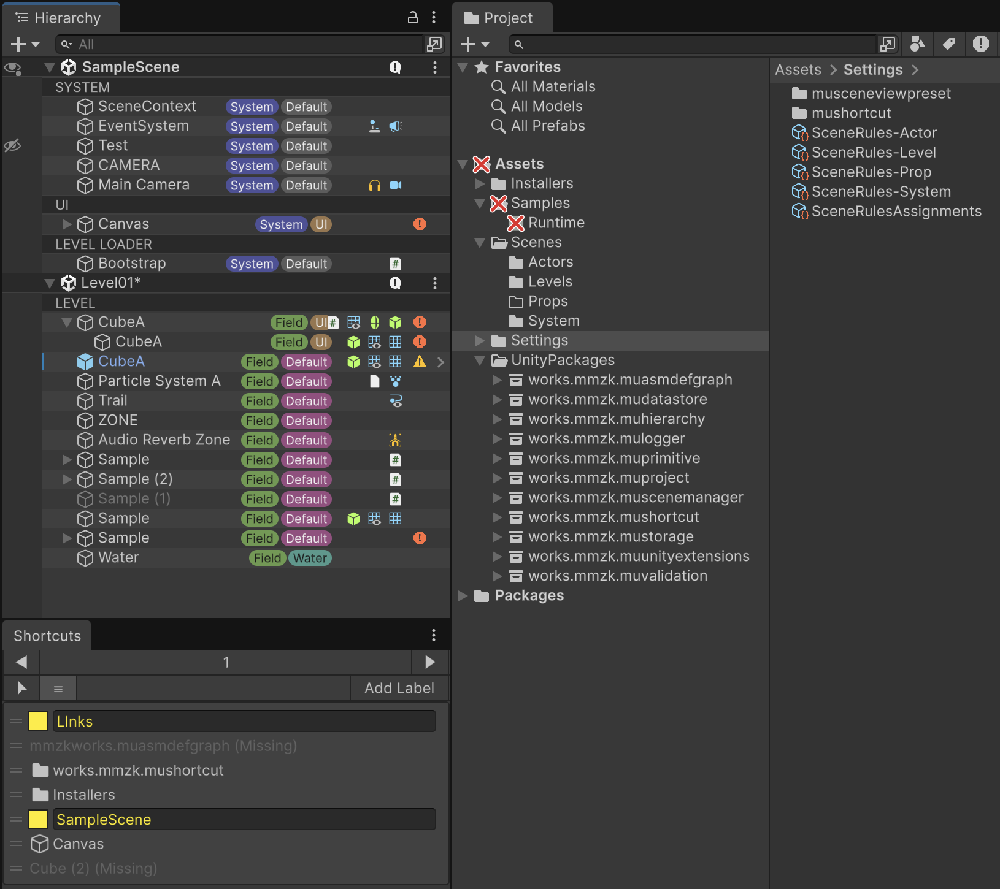

English | [日本語](README.ja.md)

> **NOTICE:**
> This is a collection of code I have been writing over time, made public in light of the recent trend where AI can implement such things in a very short time. As I am shifting toward actively using AI, the proportion of generated code is expected to grow.

## UPM Packages

### Editor Extensions

- [muHierarchy](Assets/UnityPackages/works.mmzk.muhierarchy/README.md) — Hierarchy window enhancements such as prefab/component icons and color-banded Tag/Layer labels you can change in place.
  - 
- [muProject](Assets/UnityPackages/works.mmzk.muproject/README.md) — Project window folder icons based on folder contents or path patterns.
- [muAsmdefgraph](Assets/UnityPackages/works.mmzk.muasmdefgraph/README.md) — Visualizes Assembly Definition dependencies as a graph.
- [muRefgraph](Assets/UnityPackages/works.mmzk.murefgraph/README.md) — Shows a GameObject's or Prefab's components and the objects their fields reference as a graph, grouped by assembly if you like.
- [muShortcut](Assets/UnityPackages/works.mmzk.mushortcut/README.md) — Shortcut tool for quickly selecting objects in the Hierarchy and Project windows.
- [muValidation](Assets/UnityPackages/works.mmzk.muvalidation/README.md) — Marks invalid assets in the Project window using path rules, validation attributes and scene rules.

### Scene Management

- [muSceneManager](Assets/UnityPackages/works.mmzk.muscenemanager/README.md) — Queued main/sub scene management with UniTask and an Inspector-friendly SceneId.

### Data & Storage

- [muDatastore](Assets/UnityPackages/works.mmzk.mudatastore/README.md) — Simple async key-value data store with PlayerPrefs and local file backends.
- [muStorage](Assets/UnityPackages/works.mmzk.mustorage/README.md) — Composable async binary storage (file, memory, cache, encryption, routing, ZIP packs).

### Utilities

- [muLogger](Assets/UnityPackages/works.mmzk.mulogger/README.md) — Named logger with colored log levels and a swappable ILogger interface.
- [muUnityExtensions](Assets/UnityPackages/works.mmzk.muunityextensions/README.md) — Extension methods for common Unity types such as GameObject, Vector and Texture2D.
- [muPrimitive](Assets/UnityPackages/works.mmzk.muprimitive/README.md) — Helper primitive shapes (pie, cone, line cylinder) for development, debugging and simple effects.
